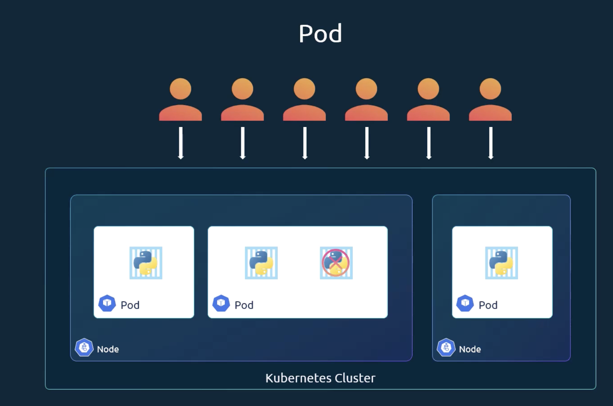

# Certified Kubernetes Application Development:

## Module 1: First Section

### First Section

* Exam is 2 hours, at-home
* 1 free retake within a 12-month window
* Not a multiple-choice test but an application-of-skills test, i.e., using the tech as it would be used IRL
* Kubernetes official documentation is allowed at all times in the exam.
* Code 30KK to get 30% off site-wide at any Linux Foundation Certification.
* Reference Documents:
    * Certified Kubernetes Application Developer: https://www.cncf.io/certification/ckad/
    * Candidate Handbook: https://www.cncf.io/certification/candidate-handbook
    * Exam Tips: https://docs.linuxfoundation.org/tc-docs/certification/tips-cka-and-ckad
* KodeKloud Discord Channel: https://discord.gg/VAfhT6ZR9E (`#ckad-sg`)

## Module 2: Core Concepts

### Recap Architecture

* Kubernetes Architecture
* Create and Configure Pods
* Nodes (Minions):
    * A machine (physical or virtual) which Kubernetes is installed on.
    * A worker machine where containers are launched
* Cluster:
    * A set of nodes grouped together, so that if one node fails the application won’t go down.
    * Having multiple nodes helps in sharing load
* Master:
    * Another node with Kubernetes installed in it, and it’s configured as a Master node.
    * Watches over the other nodes in the cluster
    * Responsible for the orchestration of containers on the worker nodes.
* Kubernetes Components:
    * API Server
        * Acts as the frontend for Kubernetes
        * Users, management devices, command line interfaces all talk with API server to interact with Kubernetes
          cluster
    * etcd service
        * Key store
        * Distributed reliable key-value store used to store all data used to manage the cluster
        * i.e., when you have multiple nodes and multiple masters in your cluster, etcd stores all that information on
          all
          the nodes in a distributed manner
            * Responsible for implementing logs in the cluster to ensure there are no conflicts between the masters
    * Kubelet service
        * The agent that runs on each node in the cluster.
        * Responsible for making sure that the containers are running on the nodes as we expect.
    * Container Runtime
        * The underlying software used to run containers
        * In this case, we’re using Docker but there are other options as well.
        * Other instances might be RKT or CRI-O
    * Controller
        * The "brain" behind the orchestration
        * Responsible for noticing and responding when nodes, containers, or endpoints go down.
        * Make decisions to bring up new containers instances.
    * Scheduler
        * Responsible to distributing work or containers across multiple nodes
        * Looks for newly created containers and assigns them to nodes.
* Master vs. Worker Nodes:
    * Worker node
        * Where the containers are hosted, ex - Docker Containers
        * To run docker containers on a system, we need a container runtime installed.
        * Has Container Runtime
        * Has Kubelet agent to provide health checks to master node and carry out actions requested by the master node.
    * Master node:
        * Has the Kubernetes API Server
        * Has etcd key-value store
        * Has the controller
        * Has the scheduler
* kubectl (CLI tool)
    * Used to deploy and manage applications on a Kubernetes cluster
    * It can be used:
        * to get cluster information
        * To get the status of other nodes in the cluster
        * To manage "many other things"
    * `kubectl run` command is used to deploy and application on the cluster
    * `kubectl cluster info` command is used to view information about the cluster
    * `kubectl get nodes` command is used to list all nodes which are part of the cluster.

### Docker vs. Containerd

* Container Runtime Interface (CRI)
    * Allowed any vendor to work as a container runtime for Kubernetes, as long as they adhered to the Open Container
      Initiative (OCI) Standards.
* Open Container Initiative (OCI)
    * Imagespec
        * Specifications to how an image should be built.
    * Runtimespec
        * Specifications to how a container runtime should be developed.
    * As long as these standards are met, anyone can build a container runtime that will work with Kubernetes.
* Because Docker was built before the CRI was introduced, it wasn’t built to support CRI standards.
* Kubernetes introduced dockershim to allow Docker to bypass the CRI standards and allow Docker to be used in
  Kubernetes.
* In v1.24, Kubernetes removed dockershim entirely and support for Docker was removed.
* Instead, the docker images relied on containerd to meet CRI standards and Docker was removed as a supported runtime in
  Kubernetes.
* Containerd
    * You can install containerd itself without having the install Docker, i.e., if you didn’t need all of Dockers other
      features.
    * `ctr` is the CLI tool to run containerd, solely made for debugging containerd as it’s not very user-friendly. Only
      supports limited features.
    * Ex.
        * `ctr images pull docker.io/library/redis:alpine`
        * `ctr run docker.io/library/redis:alpine`
    * An alternative to ctr is `nerdctl`
        * Provides a docker-like CLI for Containerd
        * Supports docker compose
        * Supports newest features in containerd
            * Encrypted container images
            * Lazy pulling
            * P2P image distribution
            * Image signing and verification
            * Namespaces in Kubernetes
        * `nerdctl` used in place of `docker`, i.e.,
            * `nerdctl run —name redis reds:alpine`
            * `nerdctl run —name webserver -p 80:80 -d nginx`
    * Another CLI tool is `crictl`
        * `crictl` provides a CLI for the CRI compatible container runtimes
        * `crictl` in installed separately
        * it's used to inspect and debug container runtimes
            * It ideally won't be used to create containers
        * The tool works across different runtimes, so long as they are OCI compatible.
        * ex
            * `crictl pull busybox`
            * `crictl images`
            * `crictl ps -a`
            * `crictl exec -it <container id> ls`
            * `crictl logs <container id>`
            * `crictl pods`
                * Unlike `docker` commands, `crictl` is aware of pods, which docker doesn't have available.

  |                | `ctr`      | `nerdctl`       | `crictl`                     |
            |----------------|------------|-----------------|------------------------------|
  | **Purpose**    | Debugging  | General Purpose | Debugging                    |
  | **Community**  | ContainerD | ContainerD      | Kubernetes                   |
  | **Works With** | ContainerD | ContainerD      | All CRI Compatible runtimes. |

### Recap: Pods

* When discussing Pods, the assumption is that the Docker image has already been built and put on a Docker repo (i.e.,
  Dockerhub) and the Kubernetes Cluster is already running.
* A pod is a single instance of an application.
* Pods are the smallest object in Kubernetes.
  
* For scaling purposes, you create multiple pods in a node rather than multiple instances of an app inside the same pod.
* If the node cannot scale further, you would create a new node in the cluster with a new pod.
* On the other hand, when scaling down, you would delete existing pods.
* A pod may have multiple containers inside it, but not the same container,
    * ie 1 python image and 1 nginx image
    * Not 2 python images.
* How to deploy pods:
    * `kubectl run nginx --image nginx`
    * List pods: `kubectl get pods`

### Recap: Pods with YAML

`pod_definition.yaml`:

```yaml
apiVersion: v1
kind: Pod
metadata:
  name: myapp-pod
  labels:
    app: myapp
    type: front-end
spec:
  containers:
    - name: nginx-container
      image: nginx
```

To deploy the pod:

```bash
kubectl apply -f pod_definition.yaml
```

To get detailed information about the pod:

```bash
kubectl describe pod myapp-pod
```

### Recap: Demo - Creating pods with YAML

### A Note on Editing Existing Pods

* If given a pod definition file, edit that file and use it to create a new pod.
* If you aren't give a pod definition file, you can extract the definition via:

```bash
kubectl get pod -o yaml > pod-definition.yaml
```

* Then, you can edit the file to make any changes, delete, and re-create the pod.
* To modify properties on the pod, you can use the following command:

```bash
kubectl edit pod 
```

* Only this list of properties is editable:
    * `spec.containers[*].image`
    * `spec.initContainers[*].image`
    * `spec.activeDeadlineSeconds`
    * `spec.tolerations`
    * `spec.terminationGracePeriodSeconds`

### Replication Controller

* Why do we need a Replication Controller?
    * High Availability
    * The Replication Controller lets us run multiple instances of a pod.
    * It can also bring up a new pod in a single pod node when the existing pod fails.
    * It ensures the specified number of pods are always running.
* Load Balancing and Scaling
    * This can be used to bring up more pods on a node, or additional pods across different nodes for scaling
    * The Replication Controller spans across multiple nodes in the cluster
    * Replication Controller vs. ReplicaSet
        * Replication Controller is the older technology that's being replaced by ReplicaSet

_rc-definition.yml:_

```yaml
apiVersion: v1
kind: ReplicationController
metadata:
  name: myapp-rc
  labels:
    app: myapp
    type: front-end
spec:
  template:
    metadata:
      name: myapp-pod
      labels:
        app: myapp
        type: front-end
    spec:
      containers:
        - name: nginx-container
          image: nginx
  replicas: 3
```

```bash
kubectl create -f rc-definition.yml
```

```bash
kubectl get replicationcontroller
```

```bash
kubectl get pods
```

_replicaset-definition.yml:_

```yaml
apiVersion: apps/v1
kind: ReplicaSet
metadata:
  name: myapp-replicaset
  labels:
    app: myapp
    type: front-end
spec:
  template:
    metadata:
      name: myapp-pod
      labels:
        app: myapp
        type: front-end
    spec:
      containers:
        - name: nginx-container
          image: nginx
  replicas: 3
  selector:
    matchLabels:
      type: front-end
```

```bash
kubectl create -f replicaset-definition.yml
```

```bash
kubectl get replicaset
```

```bash
kubectl get pods
```

* If we want to scale up to 6 replicas, we change to `replicas: 6` and then:

```bash
kubectl create -f replicaset-definition.yml
```

```bash
kubectl scale --replicas=6 -f replicaset-definition.yml
```

(I think this last one wouldn't affect the yaml, and thus probably not ideal)

```bash
kubectl scale --replicas=6 replicaset myapp-replicaset
```

(This deletes all underlying pods as well)

```bash
kubectl delete replicaset myapp-replicaset
```

```bash
kubectl replace -f replicaset-definition.yml
```

### Deployment

_deployment-definition.yml:_

```yaml
apiVersion: apps/v1
kind: Deployment
metadata:
  name: myapp-replicaset
  labels:
    app: myapp
    type: front-end
spec:
  template:
    metadata:
      name: myapp-pod
      labels:
        app: myapp
        type: front-end
    spec:
      containers:
        - name: nginx-container
          image: nginx
  replicas: 3
  selector:
    matchLabels:
      type: front-end
```

```bash
kubectl create -f deployment-definition.yaml
```

```bash
kubectl get deployments
```

To see all created objects at once, use the following command:

```bash
kubectl get all
```

### Namespaces

To see all the pods in a non-default namespace

```bash
kubectl get pods --namespace=kube-system
```

To create a pod in a separate namespace

```bash
kubectl create -f definition.yaml --namespace=dev
```

Alternately, you can add the namespace into the `definition.yaml` file under the `metadata.namespace` attribute

To create a Namespace

```yaml
apiVersion: v1
kind: Namespace
metadata:
  name: dev
```

```bash
kubectl create -f namespace-def.yaml
```

To change the default namespace to dev:

```bash
kubectl config set-context $(kubectl config current-context) --namespace=dev
```

To show the contents of all namespaces:

```bash
kubectl get pods --all-namespaces
```

To limit resources in a namespace, a ResourceQuota must be made:

```yaml
apiVersion: v1
kind: ResourceQuota
metadata:
  name: compute-quota
  namespace: dev
spec:
  hard:
    pods: "10"
    requests.cpu: "4"
    requests.memory: 5Gi
    limits.cpu: "10"
    limits.memory: 5Gi
```

### Services

Services help us connect applications together with other applications or users

* NodePort service can act similarly to a reverse proxy in that you can access an IP on a separate network, i.e.,
  external
  accessibility.
    * There are 3 ports involved
        1. Target Port: 80, the port where the webserver is running and where the service forwards the request to.
        2. Port: 80, the port on the service itself, think host port in docker for the Service Object
        3. NodePort: 30000-32767, The port which we use to access the service externally

```yaml
apiVersion: v1
kind: Service
metadata:
  name: myapp-service
spec:
  type: NodePort
  ports:
    - targetPort: 80
      port: 80
      nodePort: 30008
  selector:
    app: myapp
    type: front-end
```

port is the only required field under ports. the `spec.ports` is also an array, so multiple NodePorts can be listed here

```bash
kubectl create -f service-def.yaml
```

```bash
kubectl get services
```

* ClusterIP service creates a virtual IP inside the cluster to enable communication between different services, such as
  between frontend and backend servers

```yaml
apiVersion: v1
kind: Service
metadata:
  name: back-end
spec:
  type: ClusterIP
  ports:
    - targetPort: 80
      port: 80
  selector:
    app: myapp
    type: back-end
```

* LoadBalancer service provisions a load balancer for the application in supported cloud providers, ex to distribute
  load across different web servers in the frontend tier.

Create a Service named redis-service of type ClusterIP to expose pod redis on port 6379:

```bash
kubectl expose pod redis --port=6379 --name redis-service --dry-run=client -o yaml
or
kubectl create service clusterip redis --tcp=6379:6379 --dry-run=client -o yaml
```

```bash
kubectl expose pod nginx --port=80 --name nginx-service --type=NodePort --dry-run=client -o -yaml
or
kubectl create service nodeport nginx --tcp=80:80 --node-port=30080 --dry-run=client -o -yaml
```

The `-o` command has many different human-readable formats

1. `-o json` Output a json formatted API object

```bash
master $ kubectl create namespace test-123 --dry-run -o json
{
    "kind": "Namespace",
    "apiVersion": "v1",
    "metadata": {
        "name": "test-123",
        "creationTimestamp": null
    },
    "spec": {},
    "status": {}
}
```

2. `-o name` Print only the resource name and nothing else

```bash
 
```

3. `-o wide` Output in plain-text format w/ additional info

```bash
master $ kubectl get pods -o wide
NAME      READY   STATUS    RESTARTS   AGE     IP          NODE     NOMINATED NODE   READINESS GATES
busybox   1/1     Running   0          3m39s   10.36.0.2   node01          <​none​>         <​none​>  
ningx     1/1     Running   0          7m32s   10.44.0.1   node03          <​none​>         <​none​> 
redis     1/1     Running   0          3m59s   10.36.0.1   node01          <​none​>         <​none​> 
 
```

4. `-o yaml` Output in a yaml formatted API object

```bash
master $ kubectl create namespace test-123 --dry-run -o yaml
apiVersion: v1
kind: Namespace
metadata:
  creationTimestamp: null
  name: test-123
spec: {}
status: {}
```

For additional details: https://kubernetes.io/docs/reference/kubectl/

### kubectl explain command

To list all resources:

#### Command:

```bash
kubectl api-resources
```

#### Output:

```bash
NAME                      SHORTNAMES    APIVERSION     NAMESPACED   KIND
bindings                                v1             true         Binding
componentstatuses         cs            v1             false        ComponentStatus
configmaps                cm            v1             true         ConfigMap
endpoints                 ep            v1             true         Endpoints
events                    ev            v1             true         Event
limitranges               limits        v1             true         LimitRange
namespaces                ns            v1             false        Namespace
nodes                     no            v1             false        Node
persistentvolumeclaims    pvc           v1             true         PersistentVolumeClaim
persistentvolumes         pv            v1             false        PersistentVolume
pods                      po            v1             true         Pod
podtemplates                            v1             true         PodTemplate
replicationcontrollers    rc            v1             true         ReplicationController
resourcequotas            quota         v1             true         ResourceQuota
secrets                                 v1             true         Secret
serviceaccounts           sa            v1             true         ServiceAccount
services                  svc           v1             true         Service
```

#### Command:

```bash
kubectl explain pods
```

#### Output:

```bash
KIND:       Pod
VERSION:    v1

DESCRIPTION:
    Pod is a collection of containers that can run on a host. This resource is
    created by clients and scheduled onto hosts.

FIELDS:
  apiVersion    <string>
    APIVersion defines the versioned schema of this representation of an object.
    Servers should convert recognized schemas to the latest internal value, and
    may reject unrecognized values. More info:
    https://git.k8s.io/community/contributors/devel/sig-architecture/api-conventions.md#resources

  kind  <string>
    Kind is a string value representing the REST resource this object
    represents. Servers may infer this from the endpoint the client submits
    requests to. Cannot be updated. In CamelCase. More info:
    https://git.k8s.io/community/contributors/devel/sig-architecture/api-conventions.md#types-kinds

  metadata      <ObjectMeta>
    Standard object\'s metadata. More info:
    https://git.k8s.io/community/contributors/devel/sig-architecture/api-conventions.md#metadata

  spec  <PodSpec>
    Specification of the desired behavior of the pod. More info:
    https://git.k8s.io/community/contributors/devel/sig-architecture/api-conventions.md#spec-and-status

  status        <PodStatus>
    Most recently observed status of the pod. This data may not be up to date.
    Populated by the system. Read-only. More info:
    https://git.k8s.io/community/contributors/devel/sig-architecture/api-conventions.md#spec-and-status
```

To go deeper into a specific field (This is not comprehensive w/ all specific fields):

#### Command:

```bash
kubectl explain pods.spec
```

#### Output:

```bash
KIND:       Pod
VERSION:    v1

FIELD: spec <PodSpec>


DESCRIPTION:
    Specification of the desired behavior of the pod. More info:
    https://git.k8s.io/community/contributors/devel/sig-architecture/api-conventions.md#spec-and-status
    PodSpec is a description of a pod.

FIELDS:
  activeDeadlineSeconds <integer>
    Optional duration in seconds the pod may be active on the node relative to
    StartTime before the system will actively try to mark it failed and kill
    associated containers. Value must be a positive integer.

  affinity      <Affinity>
    If specified, the pod\'s scheduling constraints

  automountServiceAccountToken  <boolean>
    AutomountServiceAccountToken indicates whether a service account token
    should be automatically mounted.
 
  etc...
```

To output ALL fields (Comprehensive list):

#### Command:

```bash
kubectl explain pods --recursive
```

#### Output:

```bash
KIND:       Pod
VERSION:    v1

DESCRIPTION:
    Pod is a collection of containers that can run on a host. This resource is
    created by clients and scheduled onto hosts.

FIELDS:
  apiVersion    <string>
  kind  <string>
  metadata      <ObjectMeta>
    annotations <map[string]string>
    creationTimestamp   <string>
    deletionGracePeriodSeconds  <integer>
    deletionTimestamp   <string>
    finalizers  <[]string>
    generateName        <string>
    generation  <integer>
    labels      <map[string]string>
    managedFields       <[]ManagedFieldsEntry>
      apiVersion        <string>
      fieldsType        <string>
      fieldsV1  <FieldsV1>
      manager   <string>
      operation <string>
      subresource       <string>
      time      <string>
    name        <string>
    namespace   <string>
    ownerReferences     <[]OwnerReference>
      apiVersion        <string> -required-
      blockOwnerDeletion        <boolean>
      controller        <boolean>
      kind      <string> -required-
      name      <string> -required-
      uid       <string> -required-
    resourceVersion     <string>
    selfLink    <string>
    uid <string>
  
  etc...
```

Create a namespace called 'mynamespace' and a pod with image nginx called nginx on this namespace:

```bash
kubectl create namespace mynamespace
kubectl run nginx --image=nginx --namespace=mynamespace
```

Write out the yaml format of the previous pod

```bash
kubectl run nginx --image=nginx --namespace=mynamespace --dry-run=client -o yaml > nginx-def.yaml
```

```bash
cat nginx-def.yaml
```

```bash
kubectl create -f nginx-def.yaml
```

Create a busybox pod (using kubectl command) that runs the command "env". Run it and see the output

```bash
kubectl run busybox --image=busybox --command --restart=Never --rm env
```

```bash
kubectl run busybox --image=busybox --command --restart=Never env -o yaml > busybox.yaml
kubectl create -f busybox.yaml
```

Get the YAML for a new namespace called 'myns' _without_ creating it

```bash
kubectl create namespace myns --dry-run=client -o yaml
```

## Configuration

### Define, build, and modify container images

All Dockerfiles must begin with the FROM command for an operating system or an image built off an OS.
Dockerfiles follow an Instruction Argument format

```bash
docker build Dockerfile -t username/appname
```

```aiignore
INSTRUCTION ARGUMENT
```

```Dockerfile
FROM Ubuntu

RUN apt-get update
RUN apt-get install python

RUN pip install flask
RUN pip install flask-mysql

COPY . /opt/source-code

ENTRYPOINT FLASK_APP=/opt/source-code/app.py flask run
```

```Dockerfile
FROM Ubuntu

ENTRYPOINT ["sleep"]
CMD ["5"]
```

```yaml
apiVersion: v1
kind: Pod
metadata:
  name: ubuntu-sleeper-pod
spec:
  containers:
    - name: ubuntu-sleeper
      image: ubuntu-sleeper
      command: [ "sleep2.0" ]
      args: [ "10" ]
```

`ENTRYPOINT` (Dockerfile) corresponds to `command` (container)
`CMD` (Dockerfile) corresponds to `args` (container)

### ENV Variables in Kubernetes

Environment variables are a key/value pair under the container. It can be called via -e on docker run.

```bash
docker run -e APP_COLOR=pink simple-webapp-color
```

```yaml
apiVersion: v1
kind: Pod
metadata:
  name: simple-webapp-color
spec:
  containers:
    - name: simple-webapp-color
      image: simple-webapp-color
      ports:
        - containerPort: 8080
      env:
        - name: APP_COLOR
          value: pink
```

Environment Variables can be plain Key/Value pairs, a ConfigMap, or Secrets

#### Plain Key Value:

```yaml
  env:
    - name: APP_COLOR
      value: pink
```

#### ConfigMap:

```yaml
  env:
    - name: APP_COLOR
      valueFrom:
        configMapKeyRef:
```

#### Secrets:

```yaml
  env:
    - name: APP_COLOR
      valueFrom:
        secretKeyRef:
```

### ConfigMaps

* Rather than defining the key-value pairs in the pod definition, we can store the key-value pair in a ConfigMap and
  inject it into the pod

1. Create the ConfigMap
2. Inject the ConfigMap into the Pod

```yaml
  envFrom:
    - configMapRef:
      name: app-config
```

ConfigMaps can be created in two ways, imperative or declarative using a definition file.

#### Imperative ConfigMap

```bash
kubectl create configmap

kubectl create configmap <config-name> --from-literal=<key>=<value>

kubectl create configmap app-config --from-literal=APP_COLOR=blue --from-literal=APP_MOD=prod

kubectl create configmap <config-name> --from-file=<path-to-file>

kubectl create configmap app-config --from-file=app_config.properties
```

#### Declarative ConfigMap

```bash
kubectl create -f
```

#### config-map.yaml

```yaml
apiVersion: v1
kind: ConfigMap
metadata:
  name: app-config
data:
  APP_COLOR: "blue"
  APP_MODE: "prod"
```

```bash
kubectl create -f config-map.yaml
```

### Creating ConfigMaps

#### app-config

```yaml
APP_COLOR: "blue"
APP_MODE: "prod"
```

#### mysql-config

```yaml
port: 3306
max_allowed_packet: 128M
```

#### redis-config

```yaml
port: 6379
rdb-compression: yes
```

### Viewing ConfigMaps

```bash
kubectl get configmaps
kubectl describe configmaps
```

### config-map.yaml

```yaml
apiVersion: v1
kind: ConfigMap
metadata:
  name: app-config
data:
  APP_COLOR: "blue"
  APP_MODE: "prod"
```

### pod-definition.yaml

```yaml
apiVersion: v1
kind: Pod
metadata:
  name: simple-webapp-color
spec:
  containers:
    - name: simple-webapp-color
      image: simple-webapp-color
      ports:
        - containerPort: 8080
      envFrom:
        - configMapRef:
            name: app-config
```

### Create pod

```bash
kubectl create -f pod-definition.yaml
```

#### ConfigMaps in Pods

### ENV

```yaml
envFrom:
  - configMapRef:
      name: app-config
```

### Single ENV

```yaml
env:
  - name: APP_COLOR
    valueFrom:
      configMapKeyRef:
        name: app-config
        key: APP_COLOR
```

### Volume

```yaml
volumes:
  - name: app-config-volume
    configMap:
      name: app-config
```

## Secrets

```yaml
apiVersion: v1
kind: ConfigMap
metadata:
  name: app-config
data:
  DB_Host: "mysql"
  DB_User: "root"
  DB_Password: "paswrd"
```

Imperative:

```bash
kubectl create secret generic <secret-name> --from-literal=<key>=<value>
```

```bash
kubectl create secret generic app-secret \
  --from-literal=DB_Host=mysql
  --from-literal=DB_User=root
  --from-literal=DB_Password=paswrd
```

```bash
kubectl create secret generic app-secret \
  --from-file=app_secret.properties
```

Declarative:

```bash
kubectl create -f secret-data.yaml
```

#### secret-data.yaml:

```yaml
apiVersion: v1
kind: Secret
metadata:
  name: app-secret
data:
  DB_Host: mysql
  DB_User: root
  DB_Password: paswrd
```

The data should be encoded rather than putting the data in plaintext. This can be done by the following:

```bash
echo -n "mysql" | base64
```

That would change to the following:

```yaml
apiVersion: v1
kind: Secret
metadata:
  name: app-secret
data:
  DB_Host: bx1zcWw=
  DB_User: cm9vdA==
  DB_Password: cGFzd3Jk
```

To view secrets:

```bash
kubectl get secrets
```

```bash
kubectl describe secrets
```

```bash
kubectl get secret app-secret -o yaml
```

To decode the hashed values, you can do:

```bash
echo -n "bx1zcWw=" | base64 --decode
```

### Secrets in Pods

#### pod-definition.yaml:

```yaml
apiVersion: v1
kind: Pod
metadata:
  name: simple-webapp-color
spec:
  containers:
    - name: simple-webapp-color
      image: simple-webapp-color
      ports:
        - containerPort: 8080
      envFrom:
        - secretRef:
            name: app-secret
```

#### secret-data.yaml

```yaml
apiVersion: v1
kind: Secret
metadata:
  name: app-secret
data:
  DB_Host: bx1zcWw=
  DB_User: cm9vdA==
  DB_Password: cGFzd3Jk
```

```bash
kubectl create -f pod-definition.yaml
```

### Types of Secrets in Pods

ENV:

```yaml
envFrom:
  - secretRef:
      name: app-secret
```

Single ENV:

```yaml
env:
  - name: DB_Password
    valueFrom:
      secretRefKey:
        name: app-secret
        key: DB_Password
```

Volume:

```yaml
volumes:
  - name: app-secret-volume
    secret:
      secretName: app-secret
```

```bash
ls /opt/app-secret-volumes
```

Output:

```aiignore
DB_Host   DB_Password  DB_User
```

```bash
cat /opt/app-secret-volumes/DB_Password
```

Output:

```aiignore
paswrd
```

## Encrypting Secret Data at Rest

```yaml
apiVersion: apiserver.config.k8s.io/v1
kind: EncryptionConfiguration
resources:
  - resources:
      - secrets
  - providers:
      - aescbc:
          keys:
            - name: key1
              secret: <BASE 64 ENCODED SECRET>
      - identity: { }
```

To make a Base 64 Key:

```bash
head -c 32 /dev/urandom | base64
```

## Docker Security

### Security Contexts

To run as User 1000 instead of root, you can do the following in the Pod's spec.

```yaml
apiVersion: v1
kind: Pod
metadata:
  name: web-pod
spec:
  securityContext:
    runAsUser: 1000
  containers:
    - name: ubuntu
      image: ubuntu
      command: [ "sleep", "3600" ]
```

To do this at the container level it would look like this.
**NOTE: Capabilities are only supported at the container level and not the pod level.**

```yaml
apiVersion: v1
kind: Pod
metadata:
  name: web-pod
spec:
  containers:
    - name: ubuntu
      image: ubuntu
      command: [ "sleep", "3600" ]
      securityContext:
        runAsUser: 1000
        capabilities:
          add: [ "MAC_ADMIN" ]
```

## Resource Requirements

```yaml
apiVersion: v1
kind: Pod
metadata:
  name: my-pod
  labels:
    name: my-pod
spec:
  containers:
    - name: my-pod
      image: my-pod
      ports:
        - containerPort: 8080
      resources:
        requests:
          memory: "1Gi"
          cpu: 2
        limits:
          memory: "2Gi"
          cpu: 2
```

CPU Measurement of "1 cpu":
AWS: 1 AWS vCPU
Google Cloud: 1 GCP Core
Azure: 1 Azure Core
Other: 1 Hyperthread

For Memory:
You can specify in Bytes w/ no label

* 1 = 1 Byte
* 1000 = 1K (1,000 Bytes)
* 1G = 1 Gigabyte (1,000,000,000 Bytes)
* 1M = 1 Megabyte (1,000,000 Bytes)
* 1K = 1 Kilobyte (1,000 Bytes)
* 1Gi = 1 Gibibyte (1,073,741,824 Bytes)
* 1Mi = 1 Mebibyte (1,048,576 Bytes)
* 1Ki = 1 Kibibyte (1,024 Bytes)

The OOM Error stands for Out of Memory and can occur because a pod can request more memory than is available. This will
terminate the pod and throw an OOM error.

* Requests are minimum set aside for a node, Limits are maximum available for a node.

For CPU:
By Default there are no limits on a pod/node and they can use as much resources as it wants.
The ideal setup is setting requests without limits to prevent bottle-necking and to prevent
unused CPU/memory. This way it will ask for a certain threshold but still use what it can
without overrunning other nodes on a pod. It's important that all nodes have requests set
though so they get the correct amount of minimum cpu/memory, otherwise other nodes might
prevent them from working.

For Memory: This won't work because if the memory of a pod is exceeded by the requests of its nodes
it will terminate the pod. Not sure what the ideal setup for memory is.

### LimitRanges:

`limit-range-cpu.yaml:`

```yaml
apiVersion: v1
kind: LimitRange
metadata:
  name: cpu-resource-constraint
spec:
  limits:
    - default:
        cpu: 500m
      defaultRequest:
        cpu: 500m
      max:
        cpu: "1"
      min:
        cpu: 100m
      type: Container
```

`limit-range-memory.yaml:`

```yaml
apiVersion: v1
kind: LimitRange
metadata:
  name: memory-resource-constraint
spec:
  limits:
    - default:
        memory: 1Gi
      defaultRequest:
        memory: 1Gi
      max:
        memory: 1Gi
      min:
        memory: 500Mi
      type: Container
```

### ResourceQuota

For Namespace-level Resource Quotas, we can use a ResourceQuota

* This will make sure all pods don't exceed a given resource amount.

`my-resource-quota.yaml`

```yaml
apiVersion: v1
kind: ResourceQuota
metadata:
  name: my-resource-quota
spec:
  hard:
    requests.cpu: 4
    requests.memory: 4Gi
    limits.cpu: 10
    limits.memory: 10Gi
```

## Service Accounts

There are 2 types of accounts in Kubernetes:

* User Accounts (Admin, Developer, etc.)
* Service Accounts (Users used by the system, applications, Prometheus, Jenkins, etc.)
    * Service accounts use tokens to communicate between services, similar to a `curl` Bearer token.
    * By default, there is a service account created named `default`
    * The default account is automatically applied to all pods on the cluster
    * The service account gets mounted as a projected volume within the pod, like a dynamic directory
        * Located at `/var/run/secrets/kubernetes.io/serviceaccount`
        * `kubectl exec -it my-kubernetes-dashboard ls /var/run/secrets/kubernetes.io/serviceaccount` will have files
          with the token for that service account.
        * This default account has limitations, so if needed we create a new ServiceAccount

```bash
kubectl get serviceaccount
```

```bash
kubectl describe serviceaccount default
```

```bash
kubectl create serviceaccount dashboard-sa
```

`service-definition.yaml`

```yaml
apiVersion: v1
kind: ServiceAccount
metadata:
  name: dashboard-sa
  namespace: default
```

To attach a service account to a pod:
`my-pod.yaml`

```yaml
apiVersion: v1
kind: Pod
metadata:
  name: my-pod
spec:
  containers:
    - name: my-pod
      image: my-pod
  serviceAccountName: dashboard-sa
```

To Create a token:

* By default, tokens are valid for 1 hour

```bash
kubectl create token dashboard-sa
```

```bash
kubectl create token dashboard-sa --duration 2h
```

## Taints & Tolerations

* How to restrict which pods are placed on which nodes
* An analogy for Taints and Tolerations w/ a person and bugs
    * Taints would be Bugspray in this instance
    * Tolerations would be where a bug is either tolerant or intolerant to that bugspray, i.e., it may be intolerant if
      its
      a mosquito but tolerant if its a ladybug
    * In Kubernetes, the person would be a Node and the bugs would be Pods
    * If we want only a specific set of pods on a given node:
        * First we apply a Taint to the Node in question.
        * Then we apply a Toleration only to the Pods which we want to live on that node. This will prevent any unwanted
          pods on that node.
        * i.e., Node 1 has a "blue" taint. Now we apply a "blue" toleration to pod D. This will prevent pods A-C from
          living on Node 1.
            * Node 1 ("blue" taint): Pod D ("blue" tolerance)
            * Node 2: Pod A, Pod C
            * Node 3: Pod B
    * Taints/Tolerations do not require a pod to be on a specific node. In the example above, Pod D ("blue" tolerance)
      could live on Node 2 or 3.

#### To taint a node:

```bash
kubectl taint nodes node-name key=value:taint-effect
```

There are 3 Taint-Effects:

* NoSchedule
    * Pods will not be scheduled on the Node.
* PreferNoSchedule
    * System will try to avoid placing a pod on the tainted node, but it isn't guaranteed
* NoExecute
    * The system will not schedule new pods on the node, and existing pods on the node, if any, will be evicted if they
      don't tolerate the taint.

### Example taint:

```bash
kubectl taint nodes node1 app=myapp:NoSchedule
```

### To add a toleration to a Node:

```bash
kubectl taint nodes node1 app=blue:NoSchedule
```

`pod-definition.yaml`

```yaml
apiVersion: v1
kind: Pod
metadata:
  name: my-pod
spec:
  containers:
    - name: nginx-container
      image: nginx
  tolerations:
    - key: "app"
      operator: "Equal"
      value: "blue"
      effect: "NoSchedule"
```

**NOTE:** The Toleration values must be in double-quotes

The Master Node is automatically assigned a Taint to prevent pods from being deployed to the Master Node. This is a
best-practice and shouldn't be overwritten.
To see the Taint on the Master Node, you can run the following command:

```bash
kubectl describe node kubemaster | grep Taint
```

Output: `Taints: node-role.kubernetes.io/master:NoSchedule`

## Node Selectors:

* Imagine 3 nodes
    * 1 Large Node
    * 2 Small Nodes
* A Node Selector can be used to make a pod only work on a specific Node.
* This could be useful to make sure a heavy workload is only being run on the large Node
* Node Selectors have limitations, i.e., "Don't place this pod on a Small node" or "Place this pod on a Large or Medium
  node" can't be done with Node Selectors.
  `pod-definition.yaml`

```yaml
apiVersion: v1
kind: Pod
metadata:
  name: my-pod
spec:
  containers:
    - name: data-processor
      image: data-processor
  nodeSelector:
    size: Large
```

**NOTE:** The "Large" label is a label pair set on a Node.

#### To Label a Node:

```bash
kubectl label nodes node01 size=Large
```

## Node Affinity:

* The primary purpose of Node Affinity is to ensure Pods are hosted on particular Nodes.
    * i.e., Large data-processing Pod is hosted on Node 1, assuming Node 1 is Large.
    * Unlike Node Selectors, Node Affinity may be more specific about which Node(s) a Pod may be hosted on.

This Definition would be equivalent to the NodeSelector in the `pod-definition.yaml` above, however it also has more
specificity power if needed.
`pod-definition.yaml`

```yaml
apiVersion: v1
kind: Pod
metadata:
  name: my-pod
spec:
  containers:
    - name: data-processor
      image: data-processor
  affinity:
    nodeAffinity:
      requiredDuringSchedulingIgnoredDuringExecution:
        nodeSelectorTerms:
          - matchExpressions:
              - key: size
                operator: In
                values:
                  - Large
                  - Medium
```

Alternately, you could use:

```yaml
  - key: size
    operator: notIn
    values:
      - Small
```

Node Affinity Types:

* The type of Node Affinity defines the behavior of the Scheduler with respect to Node Affinity and the stages of the
  lifecycle of the pod
* Two types of Node Affinity:
    * `requiredDuringSchedulingIgnoredDuringExecution`
    * `preferredDuringSchedulingIgnoredDuringExecution`
* There is a third planned type of Node Affinity, but it is not available:
    * `requiredDuringSchedulingRequiredDuringExecution`

## Taints and Tolerations vs. Node Affinity

* We have 3 nodes and 3 pods in 3 separate colors; Red, Blue, and Green.
* Additionally, we have other unlabeled pods and nodes
    * Node 1: Blue (Blue Taint)
    * Node 2: Red (Red Taint)
    * Node 3: Green (Green Taint)
    * Node 4: Unlabeled
    * Node 5: Unlabeled
    * Pod 1: Green (Green Toleration)
    * Pod 2: Blue (Blue Toleration)
    * Pod 3: Red (Red Toleration)
    * Pod 4: Unlabeled
    * Pod 5: Unlabeled
* To solve this, we apply a taint to all colored Nodes and toleration to colored pods.
    * Unfortunately, this does not require our tolerant pods to go to the respective Node. They can still go to
      unlabeled nodes
* If we use NodeSelectors/Node Affinity:
    * It will guarantee our colored pods end up on the colored nodes, however unlabeled pods could end up on our labeled
      nodes.
* Finally, using both Taints/Tolerations **and** Node Affinity:
    * First, we add taints and tolerations to the colored pods to prevent other pods from ending up in the tainted nodes
    * Next we use NodeAffinity to prevent the colored pods from ending up in the unlabeled nodes.

Tips and Tricks for the
Exam: https://medium.com/@harioverhere/ckad-certified-kubernetes-application-developer-my-journey-3afb0901014

# Kubernetes Multi-Container Pods

* Microservices allow for decoupling of services rather than having a monolith, however at times resources may need to
  work together (i.e., Webserver and Main App) and be deployed together.
* Multi-container pods share the following:
    * Lifecycle
    * Network
    * Storage

#### To create a multi-container pod:

`multi-container-pod.yaml`

```yaml
apiVersion: v1
kind: Pod
metadata:
  name: multi-container
spec:
  containers:
    - name: web-app
      image: web-app
      ports:
        - containerPort: 8080
    - name: main-app
      image: main-app
```

### Design Patterns

* Co-located Containers
    * As described above with the main-app and web-app sharing resources
    * 2+ containers running in a pod
    * Limitation: You cannot define which container starts first in co-located containers
* Regular Init Containers
    * Used when initialization steps need to occur before the main application itself
    * i.e., an application that waits for the database to be ready before starting the main application
    * The init container starts its job, ends its job, and then the main application starts
    * Once all init containers complete, the regular containers are all started simultaneously.
* Sidecar Containers
    * Setup similar to a Regular Init container where the Sidecar starts first, followed by the main application
    * Unlike the Init Container, the Sidecar container continues to do its job for the lifecycle of the pod
    * The sidecar ends after the main app ends
    * Sidecar Starts > Main App Starts > Main App Ends > Sidecar Ends
    * Different from Co-located Containers, Sidecar containers allow the ability to set the startup order of the
      applications

`co-located-container.yaml`

```yaml
apiVersion: v1
kind: Pod
metadata:
  name: multi-container
spec:
  containers:
    - name: web-app
      image: web-app
      ports:
        - containerPort: 8080
    - name: main-app
      image: main-app
```

`regular-init-container.yaml`

```yaml
apiVersion: v1
kind: Pod
metadata:
  name: multi-container
spec:
  containers:
    - name: web-app
      image: web-app
      ports:
        - containerPort: 8080
  initContainers: # These are sequential by list-order, so db-checker runs first, then api-checker, then the main web-app container
    - name: db-checker
      image: busybox
      command: [ 'wait-for-db-to-start.sh' ]
    - name: api-checker
      image: busy-box
      command: [ 'wait-for-api-to-start.sh' ]
```

`sidecar-container.yaml`

```yaml
apiVersion: v1
kind: Pod
metadata:
  name: multi-container
spec:
  containers:
    - name: web-app
      image: web-app
      ports:
        - containerPort: 8080
  initContainers: # These are sequential by log-checker, then the main web-app container
    - name: log-checker
      image: busybox
      command: [ 'setup-log-shipper.sh' ]
      restartPolicy: Always # Because the restartPolicy has been set to Always, the log-checker will run for the lifecycle of the pod, then stop after the web-app has stopped
```

# Observability

## Readiness Probes

* The Pod Status tells us where we're at in the lifecycle of the pod.
* Pod Conditions give us a list of true or false values describing the state of the pod
    * PodScheduled
    * Initialized
    * ContainersReady
    * Ready
* These conditions can be found in the `kubectl describe po pod-name` under Conditions
* Kubernetes assumes that if the Ready condition on the Pod is met, it is ready to serve traffic. This may not be true,
  as some applications may take time after becoming ready to be usable, i.e., Jenkins taking ~10 seconds to be ready.
* What we need is a way to assign the Ready State as it pertains to the applications inside the container rather than
  the pod's status.
* There are different ways to do this, depending on the application in the pod:
    * Web applications: HTTP Test - /api/ready
    * Database applications: TCP Test - 3306
    * Alternately, you can simply execute a command that would exit successfully if this applicaton is ready.

`pod-definition.yaml`

```yaml
apiVersion: v1
kind: Pod
metadata:
  name: ready-pod-check
spec:
  containers:
    - name: ready-pod-check # http check
      image: image-name
      readinessProbe:
        httpGet:
          path: /api/ready
          port: 8080
        initialDelaySeconds: 1 # How long to delay the readinessProbe check
        periodSeconds: 3 # how long between running the readinessProbe check
        failureThreshold: 5 # number of times the check can fail
    - name: ready-pod-check # tcp check
      image: image-name
      readinessProbe:
        tcpSocket:
          port: 3306
    - name: ready-pod-check # exec command check
      image: image-name
      readinessProbe:
        exec:
          command:
            - cat
            - app/is_ready
```

## Liveness Probes

* Liveness probes are exactly like readiness probes, except using the `livenessProbes` key.

`pod-definition.yaml`

```yaml
apiVersion: v1
kind: Pod
metadata:
  name: ready-pod-check
spec:
  containers:
    - name: ready-pod-check # http check
      image: image-name
      livenessProbe:
        httpGet:
          path: /api/ready
          port: 8080
        initialDelaySeconds: 1 # How long to delay the livenessProbe check
        periodSeconds: 3 # how long between running the livenessProbe check
        failureThreshold: 5 # number of times the check can fail
    - name: ready-pod-check # tcp check
      image: image-name
      livenessProbe:
        tcpSocket:
          port: 3306
    - name: ready-pod-check # exec command check
      image: image-name
      livenessProbe:
        exec:
          command:
            - cat
            - app/is_ready
```

# Logging

## Application Logs

`event-simulator.yaml`

```yaml
apiVersion: v1
kind: Pod
metadata:
  name: event-sim-pod
spec:
  containers:
    - name: event-sim
      image: kodekloud/event-simulator
```

```bash
kubectl create -f event-simulator.yaml
```

```bash
kubectl logs -f event-sim-pod
```

If multiple containers are run in a pod, you must declare which container you want the logs from, i.e.,

```bash
kubectl logs -f event-sim-pod event-sim
```

## Monitoring Kubernetes Cluster Components

* Metrics Server
* Elastic Stack
* Prometheus
* Datadog
* Dynatrace

Heapster vs. Metrics Server

* Heapster is Deprecated
* Metrics Server is a slimmed down version
* You can have 1 Metrics Server per Kubernetes Cluster
* The Metrics Server retrieves metrics from each of the servers Nodes and Pods, aggregates them, and stores them in
  memory
* Metrics Server is **ONLY** an in-memory metrics solution
* You cannot see historical metrics w/ Metrics Server
* For Historical Data, use one of the monitoring services above.

* If using Minikube for K8s server

```bash
minikube addons enable metrics-server

```

* If using anything else:

```bash
git clone https://github.com/kubernetes-sigs/metrics-server.git 
```

```bash
kubectl create -f deploy/1.8+/
```

Once Metrics Server has had time to aggregate data, it can be accessed via:

```bash
kubectl top node
kubectl top pod
```

# Pod Design

## Labels, Selectors, and Annotations

* Labels are used to differentiate and group specific items
* Examples of Labels and Values for those Labels:
    * Color = Blue
    * Kind = Wild
    * Class = Mammal
* To specify Kubernetes labels:
  `pod-definition.yaml`

```yaml
apiVersion: v1
kind: Pod
metadata:
  name: my-pod
  labels:
    app: App1
    Function: Front-end
spec:
  containers:
    - name: my-container
      image: nginx
```

To find pods with these labels:

```bash
kubectl get pods --selector app=App1
```

Additionally, in a ReplicaSet, labels are used to group the pods:
`replica-set.yaml`

```yaml
apiVersion: apps/v1
kind: ReplicaSet
metadata:
  name: simple-webapp
  labels: # Labels of the ReplicaSet itself
    app: App1
    Function: Front-end
spec:
  replicas: 3
  selector: # The selector here is what allows the ReplicaSet to connect to the Pods via the labels defined below
    matchLabels:
      app: App1
  template:
    metadata:
      labels: # Labels defined on the Pod
        app: App1
        Function: Front-end
    spec:
      containers:
        - name: simple-webapp
          image: simple-webapp
```

`service-definition.yaml`

```yaml
apiVersion: v1
kind: Service
metadata:
  name: my-service
spec:
  selector: # This selector is used to match the Service to the Pods in the ReplicaSet
    app: App1
  ports:
    - protocol: TCP
      port: 80
      targetPort: 9376
```

#### Annotations:

`replicaset-definition.yaml`

```yaml
apiVersion: apps/v1
kind: ReplicaSet
metadata:
  name: my-replicaset
  labels:
    app: App1
    Function: Front-end
  annotations: # Used to record other details of information rather than matching another object, i.e., name, version, build number, contact details, etc.
    buildversion: 1.34
spec:
  replicas: 3
  selector:
    matchLabels:
      app: App1
  template:
    metadata:
      labels:
        app: App1
        Function: Front-end
    spec:
      containers:
        - name: simple-webapp
          image: simple-webapp
```

## Deployments, Updates, and Rollback

* When you first create a deployment, it triggers a rollout
* A new rollout creates a new ReplicaSet, which is recorded as a new deployment revision
* In the future, when the application is updated, a new rollout is triggered.
* These rollouts allow us to roll back to a previous deployment if necessary

To deploy a rollout:

```bash
kubectl rollout status deployment/myapp-development
```

To get a list of previous rollouts:

```bash
kubectl rollout history deployment/myapp-development
```

There are two types of deployment strategies:

* Recreate Strategy
    * First, destroy the old running instances of the application, then deploy new instances of the application
        * Downside: This will cause downtime between the old instances being destroyed and the new instances being
          deployed
        * ex 1,2,3,4,5 down | 1,2,3,4,5 up
* Rolling Update (Default deployment strategy)
    * We take down instances one at a time and replace them with like for like
    * Seamless update strategy without downtime
    * ex. 1 down, 1 up, 2 down, 2 up, 3 down, 3 up, etc.

To roll back a deployment, you can use the following command:

```bash
kubectl rollout undo deployment myapp-deployment
```

This will follow the deployment strategy, so by default it will use a rolling downgrade strategy

## Blue/Green Deployments

* These deployment strategies can't be defined as deployment strategies, but can be done other ways
* These deployments are best implemented Service Meshes like Istio
* Blue/Green Updates
    * We have 2 versions of the application deployed alongside each other
    * The old version is the Blue deployment
    * The new version is the Green deployment
    * All traffic is routed to the old deployment until all tests have passed on the new deployment. At that point we
      switch all traffic to the new deploy at once.
    * On base K8s, this can be done via Labels and Services:
        * On the Blue deploy, set a label of v1
        * On the Service, set a label of v1
        * On the Green deploy, set a label of v2
        * Once the Green deployment is finished, set the label on the Service to v2

`my-app-blue.yaml`

```yaml
apiVersion: apps/v1
kind: Deployment
metadata:
  name: myapp-blue
  labels:
    app: myapp
    type: front-end
spec:
  template:
    metadata:
      name: myapp-pod
      labels:
        version: v1
    spec:
      containers:
        - name: app-container
          image: myapp-image:1.0
  replicas: 5
  selector:
    matchLabels:
      version: v1
```

`service-definition.yaml`

```yaml
apiVersion: v1
kind: Service
metadata:
  name: my-service
spec:
  selector:
    version: v1
```

`my-app-green.yaml`

```yaml
apiVersion: apps/v1
kind: Deployment
metadata:
  name: myapp-green
  labels:
    app: myapp
    type: front-end
spec:
  template:
    metadata:
      name: myapp-pod
      labels:
        version: v2
    spec:
      containers:
        - name: app-container
          image: myapp-image:2.0
  replicas: 5
  selector:
    matchLabels:
      version: v2
```

Once the Green Deploy is finished, we change the Service:

`service-definition.yaml`

```yaml
apiVersion: v1
kind: Service
metadata:
  name: my-service
spec:
  selector:
    version: v2
```

* Canary Updates
    * In this version, we route only a small amount of traffic to the new deploy
    * Ex, 6 deployments, 5 blue, 1 green
    * If we don't see any errors, we swap the blue deployments over to green
    * After finished, we remove the canary deploy
    * To do this, we create a label for both deployments and set a selector in the Service, i.e., `app:Front-end`
        * This will route the traffic 50% to old, 50% to new
        * To lower the amount of traffic to the canary deployment, we reduce the number of pods in the deployment to the
          minimum.
    * Traffic split is always determined by the pods in the deployments, and as a ratio of that number, i.e., you need
      100
      pods to have control down to 1% of traffic being routed to a specific deployment.

`my-app-primary.yaml`

```yaml
apiVersion: apps/v1
kind: Deployment
metadata:
  name: myapp-primary
  labels:
    app: myapp
    type: front-end
spec:
  template:
    metadata:
      name: myapp-pod
      labels:
        version: v1
        app: front-end
    spec:
      containers:
        - name: app-container
          image: myapp-image:2.0
  replicas: 5
  selector:
    matchLabels:
      app: front-end
```

`service-definition.yaml`

```yaml
apiVersion: v1
kind: Service
metadata:
  name: my-service
spec:
  selector:
    app: front-end
```

`my-app-canary.yaml`

```yaml
apiVersion: apps/v1
kind: Deployment
metadata:
  name: myapp-canary
  labels:
    app: myapp
    type: front-end
spec:
  template:
    metadata:
      name: myapp-pod
      labels:
        version: v2
        app: front-end
    spec:
      containers:
        - name: app-container
          image: myapp-image:2.0
  replicas: 1
  selector:
    matchLabels:
      app: front-end
```

## Jobs

* We may need short-lived pods to complete jobs such as reports, send emails, etc.

`pod-definition.yaml`

```yaml
apiVersion: v1
kind: Pod
metadata:
  name: math-pod
spec:
  containers:
    - name: math-add
      image: ubuntu
      command:
        - "expr"
        - "3"
        - "+"
        - "2"
  restartPolicy: Never # Only run this pod once
```

If we create this pod on Kubernetes, the pod will compute the command, shut down the pod, and then restart and re-run
the command until a threshold has been reached.
To prevent the pod from being created indefinitely, add the `restartPolicy: Never` to the spec field.

`job-definition.yaml`

```yaml
apiVersion: batch/v1
kind: Job
metadata:
  name: math-add-job
spec:
  completions: 3 # Number of pods to run the job on
  template:
    spec:
      containers:
        - name: math-add
          image: ubuntu
          command:
            - "expr"
            - "3"
            - "+"
            - "2"
      restartPolicy: Never
```

* If we want to run the job across 3 separate pods, we can use `completions: 3`.
* These pods run in series rather than in parallel. Pod 1 finishes, then 2, then 3.
* If we want to run the jobs in parallel, we use `parallelism: 3`

`job-definition.yaml`

```yaml
apiVersion: batch/v1
kind: Job
metadata:
  name: random-error-job
spec:
  completions: 3 # Number of pods to run the job on
  parallelism: 3 # Allow 3 jobs to run in parallel
  template:
    spec:
      containers:
        - name: random-error
          image: kodekloud/random-error
      restartPolicy: Never
```

In this instance, the jobs will fail randomly until 3 jobs have completed successfully.

## CronJobs

* Allows us to create jobs with the cron scheduler.

`cron-job-definition.yaml`

```yaml
apiVersion: batch/v1
kind: CronJob
metadata:
  name: reporting-cron-job
spec:
  schedule: "*/1 * * * *"
  jobTemplate:
    spec:
      completions: 3
      parallelism: 3
      template:
        spec:
          containers:
            - name: reporting-tool
              image: reporting-tool
          restartPolicy: Never
```

# Services & Networking

## Network Policies

### Traffic

* Two types of traffic:
    * This is dependent on the perspective of the application
        * Ingress - The inbound traffic from the user to the frontend application from frontend application perspective
        * Egress - The outbound traffic from the frontend application to the rest of the stack, i.e., backend
* Example:
    * Frontend Webapp (Port 80)
        * Ingress: User to Webapp
        * Egress: Webapp to Backend server
    * Backend Server (Port 5000)
        * Ingress: Webapp to Backend server
        * Egress: Backend server to DB
    * Database (Port 3306)
        * Ingress: Backend server to DB

* Kubernetes defaults to an "All Allow" rule for network traffic between pods or services
* There may be reasons to forego the all allow strategy in favor of more specificity:
    * Security team
    * Audits
    * Etc.
* To override this default network traffic, a Network Policy would be used.
    * This could be used to only allow database traffic to come from the API server, rather than the frontend
    * A Network Policy is linked to one or more pods and rules are defined about the policy
        * i.e., only allow ingress traffic on port 3306 for the DB server
* Network policies are enforced by the network solution implemented on the Kubernetes cluster
* Even if the network is configured with a solution that doesn't support network policies won't throw errors, it just
  won't enforce the policy.
    * Solutions that support network policies
        * Kube-router
        * Calico
        * Romana
        * Weave Net
    * Solutions that **DO NOT** support network policies
        * Flannel
* Responses do not require an egress rule. If a DB has an ingress rule, the response can be sent back without a separate
  rule.

Snippet Examples:
`db-pod.yaml`

```yaml
labels:
  role: db
```

`network-policy.yaml`

```yaml
apiVersion: networking.k8s.io/v1
kind: NetworkPolicy
metadata:
  name: db-policy
spec:
  podSelector:
    matchLabels:
      role: db
  policyTypes:
    - Ingress
  ingress:
    - from:
        - podSelector:
            matchLabels:
              name: api-pod
      ports:
        - protocol: TCP
          port: 3306
```

```bash
kubectl create -f network-policy.yaml
```

## Network Policies Continued:

* This policy assumes 3 API Pods. 1 Prod, 1 Dev, 1 Test
* Additionally, we'll assume a backup server at IP address `192.168.5.10`
  `db-policy.yaml`

```yaml
apiVersion: networking.k8s.io/v1
kind: NetworkPolicy
metadata:
  name: db-policy
spec:
  podSelector:
    matchLabels:
      role: db
  policyTypes:
    - Ingress
  ingress:
    - from: # each value in the array acts as an `or` operator. This array allows the podSelector or the ipBlock. If it's inside the same array element, it's an `and` operator. i.e., the podSelector and nameSelector for `api-pod` and namespaceSelector `prod`.
        - podSelector:
            matchLabels:
              name: api-pod
          namespaceSelector:
            matchLabels:
              kubernetes.io/metadata.name: prod # If we don't want to allow connections to the Test/Dev API Pod environments
        - ipBlock:
            cidr: 192.168.5.10/32 # If we want to allow backup server access to the Database
      ports:
        - protocol: TCP
          port: 3306
```

* This policy will have an agent on the DB pod that pushes to the backup server, e.g., need an egress route for the DB
  pod's network policy.

`db-policy.yaml`

```yaml
apiVersion: networking.k8s.io/v1
kind: NetworkPolicy
metadata:
  name: db-policy
spec:
  podSelector:
    matchLabels:
      role: db
  policyTypes:
    - Ingress
    - Egress
  ingress:
    - from:
        - podSelector:
            matchLabels:
              name: api-pod
      ports:
        - protocol: TCP
          port: 3306
  egress:
    - to: # To create multiple egress/ingress points, create new `to` keys, i.e., to for both mysql and payroll
        - ipBlock:
            cidr: 192.168.5.10/32
      ports:
        - protocol: TCP
          port: 80
```

Shortened version of `networkpolicies` get command is `netpol`:

```bash
kubectl get netpol
```

## Ingress Networking

* Ingress in Kubernetes is like a layer 7 load balancer

1. Deploy Ingress Controller
    * Nginx, Traefik, etc.
2. Config Ingress Resources
    * K8s config file

`nginx-ingress-controller.yaml`

```yaml
apiVersion: apps/v1
kind: Deployment
metadata:
  name: nginx-ingress-controller
spec:
  replicas: 1
  selector:
    matchLabels:
      name: nginx-ingress
  template:
    metadata:
      labels:
        name: nginx-ingress
    spec:
      containers:
        - name: nginx-ingress-controller
          image: quay.io/kubernetes-ingress-controller/nginx-ingress-controller:0.21.0
          args:
            - /nginx-ingress-controller
            - --configmap=$(POD_NAMESPACE)/nginx-configuration
          env:
            - name: POD_NAME
              valueFrom:
                fieldRef:
                  fieldPath: metadata.name
            - name: POD_NAMESPACE
              valueFrom:
                fieldRef:
                  fieldPath: metadata.namespace
          ports:
            - name: http
              containerPort: 80
            - name: https
              containerPort: 443
```

Ingress controller requires a ConfigMap
`config-map.yaml`

```yaml
apiVersion: v1
kind: ConfigMap
metadata:
  name: nginx-configuration
```

Next we create a Service of type NodePort
`service-definition.yaml`

```yaml
apiVersion: v1
kind: Service
metadata:
  name: nginx-ingress
spec:
  type: NodePort
  ports:
    - port: 80
      targetPort: 80
      protocol: TCP
      name: http
    - port: 443
      targetPort: 443
      protocol: TCP
      name: https
  selector:
    name: nginx-ingress
```

Next we create a ServiceAccount with the appropriate roles and rolebindings

`serviceaccount-definition.yaml`

```yaml
apiVersion: v1
kind: ServiceAccount
metadata:
  name: nginx-ingress-serviceaccount
```

`ingress-wear.yaml`

```yaml
apiVersion: networking.k8s.io/v1
kind: Ingress
metadata:
  name: ingress-wear
spec:
  defaultBackend:
    service:
      name: wear-service
      port:
        number: 80
```

```bash
kubectl create -f ingress-wear.yaml
```

Split domains by subfolders
`ingress-wear-watch.yaml`

```yaml
apiVersion: networking.k8s.io/v1
kind: Ingress
metadata:
  name: ingress-wear-watch
spec:
  rules:
    - http:
        paths:
          - path: /wear
            backend:
              service:
                name: wear-service
                port:
                  number: 80
            pathType: Prefix
          - path: /watch
            backend:
              service:
                name: watch-service
                port:
                  number: 80
            pathType: Prefix
```

Split domains by subdomains
`ingress-wear-watch.yaml`

```yaml
apiVersion: networking.k8s.io/v1
kind: Ingress
metadata:
  name: ingress-wear-watch
spec:
  rules:
    - host: wear.myurl.com
      http:
        paths:
          - path: /wear
            backend:
              service:
                name: wear-service
                port:
                  number: 80
            pathType: Prefix
    - host: watch.myurl.com
      http:
        paths:
          - path: /watch
            backend:
              service:
                name: watch-service
                port:
                  number: 80
            pathType: Prefix
```

# State Persistence

## Docker Storage

There are two types of storage in Docker:

* Storage Drivers
* Volume Drivers

### Docker Storage Drivers

* How Docker stores data on its file system
* `/var/lib/docker`
    * `aufs`
    * `containers`
    * `image`
    * `volumes`

Docker's Layered Architecture

* Layer 1: Base Ubuntu Layer | 120MB
* Layer 2: Changes in apt packages | 306MB
* Layer 3: Changes in pip packages | 6.3MB
* Layer 4: Source code | 229B
* Layer 5: Update entrypoint | 0B

```dockerfile
FROM Ubuntu
RUN apt-get update && apt-get -y install python
RUN pip install flask flask-mysql
COPY . /opt/source-code
ENTRYPOINT exec FLASK_APP=/opt/source-code/app.py flask run
```

* Docker will use the existing layers from the cache as long as they are the same, i.e., an app could use a different
  Layer
  4 and it would use Layers 1-3 from cache.
* Editing any files in the image will be done on the Read-Write Layer as opposed to the base image, as its a Read-Only
  Layer.
    * The read-write layer will be discarded when the container is killed.
* If instead we want to persist data, we'll need to add a Persistent Volume to the Image.
* There are two types of data mounts:
    * Volume mount: data stored in docker's volume folder
        * `docker run -v data_volume:/var/lib/mysql mysql`
    * Bind mount: data stored elsewhere that's bound to docker data
        * `docker run -v /data/mysql:/var/lib/mysql mysql`
    * The modern way to do the mount is to use the `--mount` option to be more verbose
        * `docker run --mount type=bind,source=/data/mysql,target=/var/lib/mysql mysql`
* To store this data, docker uses Storage Drivers:
    * AUFS, ZFS, BTRFS, Device Mapper, Overlay, Overlay2
    * This is operating-system-dependent. Docker will be done automatically

### Docker Volumes

* The default docker volume plugin is `Local`
    * Others include Azure File Storage, Convoy, DigitalOcean Block Storage, Flocker, gce-docker, GlusterFS, NetApp,
      RexRay, Portworx, and VMWare vSphere Storage among others
* To use a specific volume, use the `--volume-driver` option
    * `docker run -it --name mysql --volume-driver rexray/ebs --mount src=ebs-vol,target=/var/lib/mysql mysql`

### Kubernetes Volumes

Example Pod w/ Volume

`pod-definition.yaml`

```yaml
apiVersion: v1
kind: Pod
metadata:
  name: rng-pod
spec:
  containers:
    - name: alpine
      image: alpine
      command: [ "bin/sh", "-c" ]
      args: [ "shuf -i 0-100 -n 1 >> /opt/number.out;" ]
      volumeMounts:
        - mountPath: /opt
          name: data-volume
  volumes:
    - name: data-volume
      hostPath:
        path: /data
        type: Directory
      # Alternative AWS EBS Storage:
      # awsElasticBlockStore:
      #  volumeID: <volume-id>
      #  fsType: ext4
```

### Persistent Volumes

* Rather than creating volumes on each pod, we want to create a centralized and maintainable persistent volume.

`pv-definition.yaml`

```yaml
apiVersion: v1
kind: PersistentVolume
metadata:
  name: pv-vol1
spec:
  accessModes: # ReadOnlyMany, ReadWriteOnce, or ReadWriteMany
    - ReadWriteOnce
  capacity:
    storage: 1Gi
  hostPath: # Don't use hostPath in a Production Environment
    path: /tmp/data
```

### Persistent Volume Claims

* Now that we've created the Persistent Volume, we need a PVC to access the PV.
* An administrator creates the Persistent Volumes, the User creates the Persistent Volume Claims
* Each PVC is bound to a single PV
* Kubernetes will make sure each PV has Sufficient Capacity, Access Modes, Volume Modes, and Storage Class appropriate
  to the PVC.
* Labels and Selectors can be used to bind specific PV to PVC.

`pvc-definition.yaml`

```yaml
apiVersion: v1
kind: PersistentVolumeClaim
metadata:
  name: myclaim
spec:
  accessModes:
    - ReadWriteOnce
  resources:
    requests:
      storage: 500Mi
```

This PVC would be bound to the previous PV because the requested storage is sufficient (500Mi vs. 1Gi)

To create a PVC within a Pod, you can set it up like the following:

* This can also be done in the pod section of ReplicaSets and Deployments

  `pod-definition.yaml`

```yaml
apiVersion: v1
kind: Pod
metadata:
  name: mypod
spec:
  containers:
    - name: myfrontend
      image: nginx
      volumeMounts:
        - mountPath: "/var/www/html"
          name: mypd
  volumes:
    - name: mypd
      persistentVolumeClaim:
        claimName: myclaim
```

Stateful sets work in an Ordered, graceful deployment
They also use stable, unique network identifier
Essentially a Deployment w/ an extra field

Headless Services can be created just like a `Service`, except there is a `clusterIP: none` under spec

# Security

## Security Primitives

* Secure Hosts
    * Disable Password Authentication
    * SSH key based auth
* Secure Kubernetes
    * Controlling access to the API server itself
        * Who can access the cluster?
            * Static Token File
            * Certificates
            * External Authentication providers - LDAP
            * and for Machines: Service Accounts
        * What can they do?
            * RBAC Authorization
            * ABAC Authorization
            * Node Authorization
            * Webhook Mode
    * All communication on the cluster is secured by TLS Encryption
    * Network Policies

## Authentication

* Types of Accounts that will be accessing the cluster
    * Administrative Users
        * Admins
        * Developers
    * End Users
    * Service Accounts
        * Bots
* Kubernetes does not allow for the creation of user accounts individually, but it does allow for the creation for
  ServiceAccounts
* Accounts
    * All Administrative User access is managed by the API Server
        * `kubectl`
        * `curl https://kube-server-ip:port/`

### Auth Mechanisms

1. kube-apiserver
    * Static Token Files
        * Not recommended as it stores usernames, passwords, and tokens in plaintext
    * Certificates
    * Identity Services
2. Authenticate User
3. Process Request

`/tmp/users/user-details.csv`

```csv
User File Contents
password123,user1,u0001
password123,user2,u0002
password123,user3,u0003
password123,user4,u0004
password123,user5,u0005
```

```yaml
apiVersion: v1
kind: Pod
metadata:
  name: kube-apiserver
  namespace: kube-system
spec:
  containers:
    - command:
        - kube-apiserver
        - --authorization-mode=Node,RBAC
        - --basic-auth-file=/tmp/users/user-details.csv
      image: k8s.gcr.io/kube-apiserver-amd64:v1.11.3
      name: kube-apiserver
      volumeMounts:
        - mountPath: /tmp/users # user-details csv here
          name: usr-details
          readOnly: true
  volumes:
    - hostPath:
        path: /tmp/users
        type: DirectoryOrCreate
      name: usr-details
```

```yaml
apiVersion: rbac.authorization.k8s.io/v1
kind: Role
metadata:
  namespace: default
  name: pod-reader
rules:
  - apiGroups: [ "" ] # "" indicates the core API group
    resources: [ "pods" ]
    verbs: [ "get", "watch" ]
```

```yaml
apiVersion: rbac.authorization.k8s.io/v1
kind: RoleBinding
metadata:
  name: read-pods
  namespace: default
subjects:
  - kind: User
    name: user1 # Name is case-sensitive
    apiGroup: rbac.authorization.k8s.io
roleRef:
  kind: Role # this must be a Role or ClusterRole
  name: pod-reader # this must match the name of the Role or ClusterRole you wish to bind to
  apiGroup: rbac.authorization.k8s.io
```

```bash
curl -v -k https://localhost:6443/api/v1/pods -u "user1:password123"
```

### Security KubeConfig

```$HOME/.kube/config
--server my-kube-playground:6443
--client-key admin.key
--client-certificate admin.crt
--certificate-authority ca.crt
```

```bash
kubectl get pods --kubeconfig config
```

* KubeConfig file has 3 sections:
    * Clusters
        * Development
        * Production
        * AWS
        * MyKubePlayground
    * Users
        * Admin
        * Dev User
        * Prod User
        * MyKubeAdmin
    * Contexts
        * Admin@Production
        * Dev User@AWS
        * Prod User@Production
        * MyKubeAdmin@MyKubePlayground

`config-definition.yaml`

```yaml
apiVersion: v1
kind: Config
clusters:
  - name: my-kube-playground
    cluster:
      certificate-authority: ca.crt
      server: https://my-kube-playground:6443
contexts:
  - name: my-kube-admin@my-kube-playground
    context:
      cluster: my-kube-playground
      user: my-kube-admin
users:
  - name: my-kube-admin
    user:
      client-certificate: admin.crt
      client-key: admin.key
```

```yaml
apiVersion: v1
kind: Config
current-context: dev-user@aws
clusters:
  - name: my-kube-playground
  - name: development
  - name: production
  - name: aws
contexts:
  - name: my-kube-admin@my-kube-playground
  - name: dev-user@aws
  - name: prod-user@production
users:
  - name: my-kube-admin
  - name: prod-user
  - name: dev-user
  - name: admin
```

To view the current config file:

* **Note:** If you don't specify which config file to use, it will use `$HOME/.kube/config`

```bash
kubectl config view
```

```bash
kubectl config view -kubeconfig=custom-config
```

If you need to change the context of your kubectl, you can use the following command:

* This change will reflect in the file as well

```bash
kubectl config use-context prod-user@production
```

You can also change the namespace within a context via the `namespace` option under context:
Additionally, it is recommended to use the full path to the certificate files, i.e., `/etc/kubernetes/pki/<cert_name>`

`config-definition.yaml`

```yaml
apiVersion: v1
kind: Config
clusters:
  - name: my-kube-playground
    cluster:
      certificate-authority: /etc/kubernetes/pki/ca.crt
      server: https://my-kube-playground:6443
contexts:
  - name: my-kube-admin@my-kube-playground
    context:
      cluster: my-kube-playground
      user: my-kube-admin
      namespace: finance
users:
  - name: my-kube-admin
    user:
      client-certificate: /etc/kubernetes/pki/admin.crt
      client-key: /etc/kubernetes/pki/admin.key
```

If instead you want to use the certificates directly, you need to base64 encode them. Then change the field from
`certificate-authority` to `certificate-authority-data`

```bash
cat /etc/kubernetes/pki/ca.crt | base64
```

`config-definition.yaml`

```yaml
apiVersion: v1
kind: Config
clusters:
  - name: my-kube-playground
    cluster:
      certificate-authority-data: "<base64_encoded_value_here>"
      server: https://my-kube-playground:6443
contexts:
  - name: my-kube-admin@my-kube-playground
    context:
      cluster: my-kube-playground
      user: my-kube-admin
      namespace: finance
users:
  - name: my-kube-admin
    user:
      client-certificate: /etc/kubernetes/pki/admin.crt
      client-key: /etc/kubernetes/pki/admin.key
```

If you see a config definition w/ an encoded certificate, you can decode it by running the following:

```bash
echo "<base64_encoded_value_here>" | base64 --decode
```

## API Groups

* All of the `kubectl` commands are interfacing with the api
* Alternately, if we curl the master node's address, we can get the version by doing
  `curl https://kube-master:6443/version` and pods by `curl https://kube-master:6443/api/v1/pods`
* There are 2 primary api commands we're interested in
    * Core `/api`
        * `/v1`
            * namespaces, pods, rc, events, endpoints, nodes, etc.
    * Named `/apis`
        * API Groups: `/apps`, `/extensions`, `/networking.k8s.io`, `/storage.k8s.io`, etc.
        * API Resources: `/apps` -> `/v1` -> `/deployments`
        * API Verbs: `/apps` -> `/v1` -> `/deployments` -> `[list, get, create, delete, etc.]`
* To access the cluster like this, you need to pass along credentials, otherwise it'll throw forbidden error on
  endpoints which require auth
* An alternate option to access the cluster is by using a kubectl-proxy, that way you don't have to pass credentials
  along on all curl requests

```bash
kubectl proxy
```

* `kube-proxy` is different from `kubectl proxy`
    * `kube-proxy` Used to enable connectivity between pods and services across nodes
    * `kubectl proxy` HTTP proxy service used to access the cluster's API server

## Authorization

* Why Authorization?
    * We don't necessarily want all users (including bots) to have the same access to the cluster
    * We may not want developers to delete nodes for example, and we may only want the bots to have the minimum access
      needed for their actions.
* Authorization Mechanisms
    * Node
        * Node Authorizer - Kubelets should be in the group system:node so any requests coming from a user with the name
          system:node or part of the system:node group is authorized by the node authorizer
    * ABAC
        * Attribute-Based Access Controls
        * Create an authorization policy that determines what a user can do on the cluster
        * Each time you need to update the policy, you must also restart the kube api server.
        * Difficult to manage
    * RBAC
        * Role-Based Access Controls
        * Rather than associating a user or group with a specific policy, we define a role (i.e., Developer, Admin,
          etc.)
        * Now we update the Role rather than the Policy to update the cluster
    * Webhook
        * If you want an external service to handle the authorization (i.e., Open Policy Agent)
    * AlwaysAllow [Default]
        * Always allows all authorization requests
        * This is the Default mode on a cluster
    * AlwaysDeny
        * Always denies all authorization requests
* These authorization methods can be chained, i.e., Node -> RBAC -> Webhook
    * These are and ordered list, so it would authorize via Node first, then RBAC, then Webhook requests.
    * Once a user has been authorized by one of the methods, the other methods are skipped.
        * if Node works, RBAC and Webhook are ignored
        * if Node and RBAC fail authorization, but Webhook succeeds, the request will be successful
    * ex: `--authorization-mode=Node,RBAC,Webhook`

## Role-Based Access Controls

Creating a Role:

* Developer: Can view, create, and delete Pods. Can create ConfigMaps.

`developer-role.yaml`

```yaml
apiVersion: rbac.authorization.k8s.io/v1
kind: Role
metadata:
  name: developer
rules:
  - apiGroups:
      - ""
    resources:
      - "pods"
    verbs:
      - list
      - get
      - create
      - update
      - delete
  - apiGroups:
      - ""
    resources:
      - ConfigMap
    verbs:
      - create
```

To associate a User to a Role, we'll need to create a RoleBinding:

```yaml
apiVersion: rbac.authorization.k8s.io/v1
kind: RoleBinding
metadata:
  name: devuser-developer-rolebinding
subjects:
  - kind: User
    name: dev-user
    apiGroup: rbac.authorization.k8s.io
roleRef:
  apiGroup: rbac.authorization.k8s.io
  kind: Role
  name: developer
```

**Note:** Roles/Rolebindings are namespace-dependent, so make sure to select a namespace if you don't want the role in
the default namespace

```bash
kubectl get roles
kubectl get rolebindings
kubectl describe role developer
kubectl describe rolebinding devuser-developer-rolebinding
```

Checking Access:

* As a user, you can check and see if you have access to certain commands via:

```bash
kubectl auth can-i create deployments
kubectl auth can-i delete nodes
kubectl auth can-i create deployments --as dev-user
kubectl auth can-i create pods --as dev-user
kubectl auth can-i create pods --as dev-user --namespace test
```

Resource Names:

```yaml
apiVersion: rbac.authorization.k8s.io/v1
kind: Role
metadata:
  name: developer
rules:
  - apiGroups:
      - ""
    resources:
      - "pods"
    verbs:
      - list
      - get
      - create
      - update
      - delete
    resourceNames: # If you only wanted a user to have access to pods w/ specific named resources
      - silver
      - gold
```

## Cluster Roles

* Rather than namespaced roles, the Cluser Roles will be valid for the whole cluster
* Examples of Cluster-Scoped Resources:
    * nodes
    * persistentvolumes
    * clusterroles
    * cluterrolebindings
    * certificatesigningrequests
    * namespaces
    * And more...

To see the namespaced vs. non-namespaced resources:

```bash
kubectl api-resources --namespaced=true
kubectl api-resources --namespaced=false
```

An example of a ClusterRole that might be necessary:

* Cluster Admin who needs to view, create, and delete Nodes
* Storage Admin who needs to view, create, and delete Persistent Volumes/Persistent Volume Claims

```yaml
apiVersion: rbac.authorization.k8s.io/v1
kind: ClusterRole
metadata:
  name: cluster-administrator
rules:
  - apiGroups: [ "" ]
    resources: [ "nodes" ]
    verbs: [ "list", "get", "create", "delete" ]
```

```yaml
apiVersion: rbac.authorization.k8s.io/v1
kind: ClusterRoleBinding
metadata:
  name: cluster-admin-role-bindings
subjects:
  - kind: User
    name: cluster-admin
    apiGroup: rbac.authorization.k8s.io
roleRef:
  kind: ClusterRole
  name: cluster-administrator
  apiGroup: rbac.authorization.k8s.io
```

**NOTE:** You can create a ClusterRole for namespaced resources as well, giving that user access to the rules across all
resources

## Admission Controllers

* If you want to create Authorization with more specificity than a typical RBAC, you would use an Admission Controller
    * ex, "Only permit images from a specific registry", "do not permit runAs root user", "Only permit certain
      capabilities", "Pod must always have labels"
    * By default, the following Admission Controllers are available:
        * AlwaysPullImages
        * DefaultStorageClass
        * EventRateLimit
        * NamespaceExists
        * Many more...
* Example using the `NamespaceExists [Default]` Admission Controller:

```bash
kubectl run nginx --image nginx -n blue
```

```terminaloutput
Error from server (Not Found): namespaces "blue" not found
```

* An alternative to `NamespaceExists` is `NamespaceAutoProvision` to create a namespace automatically if it doesn't
  exist

Viewing the enabled Admission Controllers:
`kubectl exec kube-apiserver-controlplane -n kube-system -- kube-apiserver -h | grep enableadmission-plugins`

To add admission controllers, update the `/etc/kubernetes/manifests/kube-apiserver.yaml`

```yaml
apiVersions: v1
kind: Pod
metadata:
  creationTimestamp: null
  name: kube-apiserver
  namespace: kube-system
spec:
  containers:
    - command:
        - --enable-admission-plugins=NodeRestrictions,NamespaceAutoProvision # this line
        - --disable-admission-plugins=DefaultStorageClass # disable default admission plugins here
      image: k8s.gcr.io/kube-apiserver-amd64:v1.11.3
      name: kube-apiserver
```

```bash
kubectl run nginx --image nginx -n blue
```

```terminaloutput
Pod/nginx created!
```

```bash
kubectl get namespaces
```

```terminaloutput
NAME        STATUS  AGE
blue        Active  1m
default     Active  55m
```

## Validating and Mutating Admission Controllers

* The `NamespaceExists` is an example of a Validation Admission Controller
    * It validates that a namespace exists when creating a resource which uses it.
* The `DefaultStorageClass` in an example of a Mutating Admission Controller
    * It mutates the PVC to use the default storage class.
* Generally, mutating AC's are invoked before validation ACs so any change made by the mutating AC can be validated by
  the validation AC.
    * Example: `NamespaceAutoProvision` and `NamespaceExists`
        * The `NamespaceAutoProvision` runs first, and then after the namespace has been created, the `NamespaceExists`
          runs.
        * If it were backwards, the `NamespaceExists` AC would always reject the resource before it could create the
          resource's new namespace.
* If any validating AC fails validation, it will output an error to the user and fail to create the resource(s).
* If we want to create our own custom Admission Controllers, there are two that we can use:
    * MutatingAdmissionWebhook
    * ValidatingAdmissionWebhook
* How do we set a custom Admission Controller up?
    * First, we deploy our Admission Webhook Server
        * The Admission Webhook server is a server you deploy with the logic or code to permit or reject a request
        * It must be able to receive and respond with the appropriate responses that the Webhook expects
        * If deployed in the cluster, it will need a service, i.e., `webhook-service`
    * Second, we configure the webhook on Kubernetes by creating a Webhook Configuration Object
        *

```yaml
apiVersion: admissionregistration.k8s.io/v1
kind: ValidatingWebhookConfiguration
metadata:
  name: "pod-policy.example.com"
webhooks:
  - name: "pod-policy.example.com"
    clientConfig:
      service:
        namespace: "webhook-namespace"
        name: "webhook-service"
      caBundle: "ajsdnfakj...0s9adfu"
    rules:
      - apiGroups: [ "" ]
        apiVersions: [ "v1" ]
        operations: [ "CREATE" ]
        resources: [ "pods" ]
        scope: "Namespaced"
```

## API Versions

* When an API group is on the `/v1` version, that means it's on the GA (Generally Available) Stable Version.
* Alternatives to `/v1` are:
    * `/v1alpha`: Alpha
        * Version Name: `vXalphaY` (eg: v1alpha1)
        * Enabled: No - Can enable via flags
        * Tests: May lack e2e tests
        * Reliability: May have bugs
        * Support: No commitment; may be dropped later
        * Audience: Expert Users interesting in giving early feedback
    * `/v1beta`: Beta
        * Version Name: `vXbetaY` (eg: v1beta1)
        * Enabled: Yes, by default
        * Tests: Has e2e tests
        * Reliability: May have minor bugs
        * Support: Commits to complete the feature and move to GA
        * Audience: Users interested in beta testing and providing feedback
    * `/v1`: GA (Stable)
        * Version Name: `vX` (eg: v1)
        * Enabled: Yes, by default
        * Tests: Has conformance tests
        * Reliability: Highly reliable
        * Support: Will be present in many future releases
        * Audience: All users
* API groups can support multiple API versions at the same time:
    * `/api/apps/` can support `/v1alpha1`, `v1beta1`, and `v1` for example
* Although they can be available, there is only one Preferred or Storage version
    * This is the default api group used when using the api to make updates
        * i.e., `kubectl get deployment` will use the `v1` command as it's the preferred version.
    * The Storage version is the version which an object is stored in etcd, respective the the version used in the yaml
      file to create it.
    * Preferred and Storage versions can be different, although that's not typical.

## API Deprecations

* API Deprecation Policy Rule #1
    * API elements may only be removed by incrementing the version of the API group.
        * For example, if a resource is in `/v1alpha1/webinar`, to remove it, you'd need to upgrade the API group to
          `/v1alpha2/`
* API Deprecation Policy Rule #2
    * API objects must be able to round-trip between API versions in a given release without information loss, except
      the whole REST resources that do not exist in some versions.
        * If a field is added to a spec between `v1alpha1/course` for duration and `v1alpha2/course`, it must be
          backfilled to exist in `v1alpha1`
* API Deprecation Policy Rule #3
    * An API version in a given track may not be deprecated until a new API version at least as stable is released.
        * This means that if a `v2alpha1` version is created, it cannot deprecate a `v1` release. It must be a `v2`
          version that can deprecate `v1`
* API Deprecation Policy Rule #4a
    * Other than the most recent API versions in each track, older API versions must be supported after their announced
      deprecation for a duration of no less than:
        * GA: 12 months or 3 releases (whichever is longer)
        * Beta: 9 months or 3 releases (whichever is longer)
        * Alpha: 0 releases
* API Deprecation Policy Rule #4b
    * The "preferred" API version and the "storage version" for a given group may not advance until after the release
      has been made that supports both the new version and the previous version.

### Kubectl convert

* To convert an old yaml file to the new API version, you can run the following command:

```bash
kubectl convert -f <old-file> --output-version <new-api>
kubectl convert -f old-api.yaml --output-version apps/v1
```

`kubectl convert` may not be available by default as it's a plugin, so it may need to be added manually.
`- --runtime-config=kubernetes.k8s.io=v1alpha1` as an example of updating an API group to an alpha version. This is done
inside the `/etc/kubernetes/manifests/kube-apiserver.yaml`

## Custom Resource Definitions (CRD)

* To create a Custom Resource, we need a custom resource and a custom controller

`flightticket.yaml`

```yaml
apiVersions: flights.com/v1
kind: FlightTicket
metadata:
  name: my-flight-ticket
spec:
  from: Mumbai
  to: London
  number: 2
```

`flight-ticket-definition.yaml`

```yaml
apiVersion: apiextensions.k8s.io/v1
kind: CustomResourceDefinition
metadata:
  name: flighttickets.flights.com
spec:
  group: flights.com
  names:
    kind: FlightTicket
    singular: flightticket
    plural: flighttickets
    shortNames:
      - ft
  scope: Namespaced
  versions:
    - name: v1
      served: true
      storage: true
      schema:
        openAPIV3Schema:
          type: object
          properties:
            spec:
              type: object
              properties:
                from:
                  type: string
                to:
                  type: string
                number:
                  type: integer
                  minimum: 1
                  maximum: 10
```

```bash
kubectl create flight-ticket-definition.yaml
kubectl create -f flightticket.yaml
```

## Custom Controllers

* Any process or code that runs in a loop that is continuously monitoring the Kubernetes cluster and listening to event
  of specific objects being changed (in the example's case, the `flightticket` object)
* Go is the recommended language for programming custom controllers
* We customize the `controller.go` with our new custom logic
* `go build -r sample-controller .`
* `./sample-controller --kubeconfig=$HOME/.kube/config`

## Operator Framework

* An operator framework can be used to deploy the Custom CRD and Custom Controller at the same time.
* The `etcd` operator is an operator used to manage an `etcd` cluster
* Operators are available at `OperatorHub.io`
    * Examples are etcd, Grafana, Prometheus, etc.

# Helm Fundamentals

## Helm Introductions

* Helm is similar to a Package Manager for Kubernetes
* Rather than having to keep individual yaml files for all of the pieces of the cluster, then applying them, then
  editing them if things change, Helm allows us to look at the application from a top-down view based on the package
  name of the cluster.
* Helm is like a game installer; rather than installing all of the files in a game's folder individually, we use the
  install wizard and it completes the difficult parts for us.

```bash
helm install wordpress
```

For any changes we need that are different from the default values, we can place those in a `values.yaml` file.

We can also upgrade, rollback, and uninstall our application with a single command:

```bash
helm upgrade wordpress
helm rollback wordpress
helm uninstall wordpress
```

To get your current Operating System:

```bash
cat /etc/*release*
```

## Helm Concepts

Instead of storing values which may change in the individual yaml files, i.e., `deployment.yaml`, `secrets.yaml`,
`pvc.yaml`

* We replace the values with a variable, `{{ .Values.<variable-name> }}`, for example `{{ .Values.storage }}`
* To access the values in the variable, we create a yaml file that stores these values.

`values.yaml`

```yaml
storage: 1Gi
image: wordpress:4.8-apache
passwordEncoded: ASDasdfaSDF==
```

Together, the Template and the Values yaml files form a **Helm Chart**

* Helm Chart Contents
    * Templates
    * values.yaml
    * Chart.yaml

`chart.yaml`

```yaml
apiVersion: v2
name: Wordpress
version: 9.0.3
description: A Wordpress description
keywords:
  - wordpress
  - cms
  - blog
  - http
  - web
  - application
  - php
home: http://www.wordpress.com/
sources:
  - https://github.com/bitnami/bitnami-docker-wordpress
maintainers:
  - email: containers@bitnami.com
    name: Bitnami
```

Existing Charts can be found at ArtifactHub.io
You can search at their website, or alternately `helm search hub wordpress`
Other repositories use different repos, ex:

```bash
helm repo bitnami https://charts.bitnami.com/bitnami
helm search repo wordpress
helm repo list
```

To install a chart:

```bash
helm install [release-name] [chart-name]
helm install release-1 bitnami/wordpress
helm install release-2 bitnami/wordpress
helm install release-3 bitnami/wordpress
```

This would create 3 separate installs of the different releases

Other commands:

```bash
helm list
helm uninstall my-release
helm pull --untar bitname/wordpress
ls wordpress
helm install release-4 ./wordpress
```
